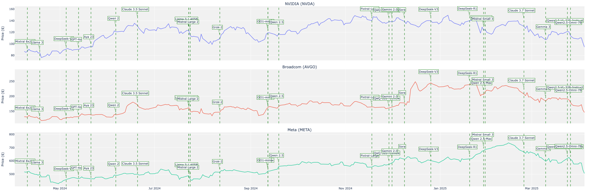

# LLM vs Markets

A quick look at LLM releases vs major market indices.

Data compiled through Grok 3 and o1, with some manual fact checks.

 ## Example




## Development

```bash
pip install -r requirements.txt
```

## Usage
Start the app with:
```bash
python app.py
```
## Todo
- Consolidate to single chart with ticker overlay 
- Fact Check and Add more releases 
- Add option to select any ticker, instead of presets 
- UI Cleanup 
- Add more context to the LLM release dates 
- Add option for finer details on candlestick chart 
